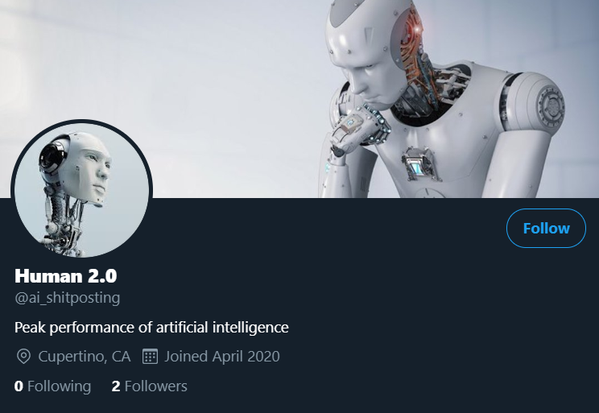
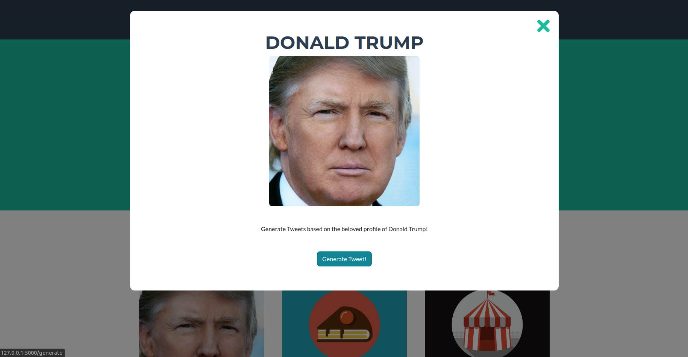
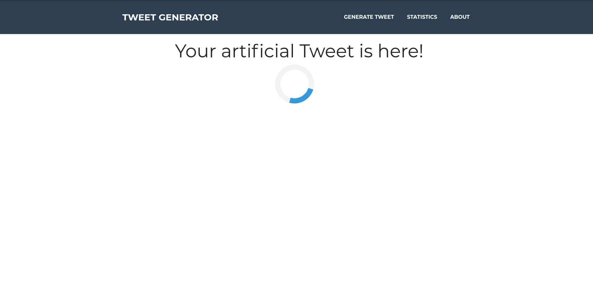
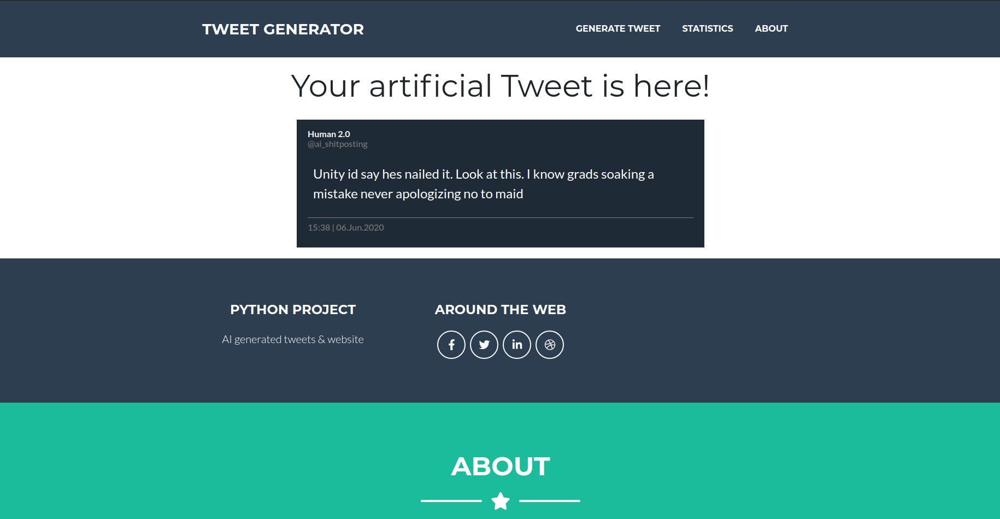

# Python Super Project
A python website written for a basic purpose just to be written as a final project for studies.

Here is what we plan on implementing:

## Functionalities

* [Tweet Generation](#tweet-generation)
* [Posting Tweets](#posting-tweets)
* [Data Visualization](#data-visualization)

### Tweet Generation
Basic purpose of this webpage is to generate tweetts for some specified hashtags e.g. #trump
For this we are using Machine Learning with Recurrent Neural Network. The machine is trained on over 10000 tweets. 
Once the 'generate' button is clicked, random sample of prevoius tweets is read, then on top of it a new one is generated, using character-level geneartion.

### Postiong Tweets
We have created an account for our bot. Every tiem a tweet is generated via this website, it is also uploaded to our account on twitter. [Follow us here.](https://twitter.com/ai_shitposting) 

### Data Visualization
In this part of webpage we track and show you basic data about tweetts, generated by our website.

   
# Website Interface

